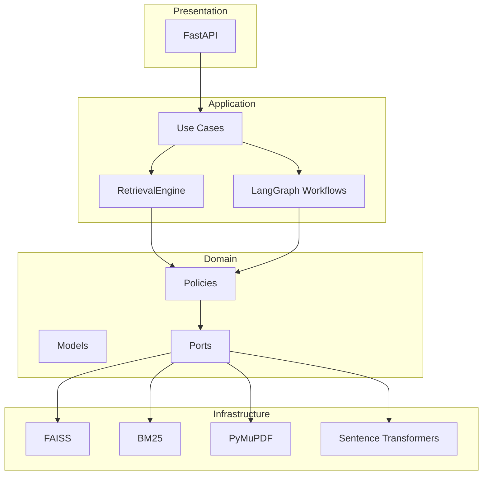
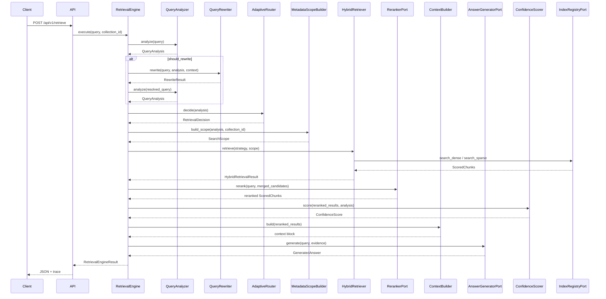
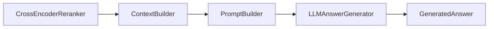

# Adaptive Hybrid RAG Platform — Architecture

Production-quality RAG system demonstrating enterprise AI engineering: clean architecture, adaptive hybrid retrieval, LangGraph orchestration, and explainability-first design.

---

## Overall Architecture



### Layer responsibilities

| Layer | Responsibility | Depends on |
|---|---|---|
| **Presentation** | HTTP routes, request/response schemas | Application |
| **Application** | Use cases, workflow orchestration, `RetrievalEngine` | Domain ports & policies |
| **Domain** | Business models, policies, port interfaces | Nothing external |
| **Infrastructure** | Adapters (FAISS, BM25, PDF, embeddings) | Domain ports |

**Dependency rule:** Domain never imports LangChain, LangGraph, FAISS, or FastAPI.

---

## Request Lifecycle (Retrieval)



### Ingestion lifecycle

```
PDF Upload → PyMuPDF Loader → Metadata Extraction → Adaptive Chunker
    → Embed (Sentence Transformers) → FAISS + BM25 Index → Persist
```

Orchestrated by a LangGraph pipeline: `load → extract_metadata → chunk → index`.

---

## Folder Structure

```
src/adaptive_rag/
├── domain/
│   ├── models/          # Document, Chunk, QueryAnalysis, ConfidenceScore, ...
│   ├── ports/           # VectorStorePort, IndexRegistryPort, LLMPort, ...
│   └── policies/        # RRF, QueryAnalyzer, AdaptiveRouter, ConfidenceScorer
├── application/
│   ├── dto/             # Request/response DTOs
│   ├── services/        # RetrievalEngine, HybridRetriever
│   ├── use_cases/       # IngestDocument, HybridRetrieval, ...
│   └── workflow/        # LangGraph graphs + nodes
├── infrastructure/
│   ├── pdf/             # PyMuPDF loader
│   ├── vector_store/    # FAISS adapter + factory
│   ├── sparse/          # BM25 adapter + factory
│   ├── embeddings/      # Sentence Transformers
│   ├── reranking/       # Cross-encoder reranker + fake adapter
│   └── storage/         # CollectionIndexRegistry
├── api/                 # FastAPI app, routes, DI container
├── config/              # Pydantic Settings
└── observability/       # Structured logging
```

---

## Phase Roadmap

| Phase | Status | Scope |
|---|---|---|
| **0** | ✅ | Project skeleton, ports, DI, empty LangGraph |
| **1** | ✅ | PDF ingestion, adaptive chunking, FAISS + BM25 indexing |
| **2** | ✅ | Hybrid retrieval, RRF fusion, retrieval API |
| **3** | ✅ | Query analysis, adaptive router, metadata scope, confidence, `QueryType` taxonomy |
| **4A** | ✅ | Query rewriting (conditional) |
| **4B** | ✅ | Query decomposition (conservative, sequential retrieval) |
| **5A** | ✅ | Cross-encoder reranking (`RerankerPort`, post-merge, pre-confidence) |
| **5B** | ✅ | Evidence-grounded answer generation (`AnswerGeneratorPort`, prompt templates) |
| **5C** | 🔜 | Citation formatting and verification |
| **6** | 🔜 | Hallucination guard, grounding validation |
| **7** | 🔜 | RAGAS evaluation, LLM-as-Judge, observability |
| **8** | 🔜 | Explainability dashboard, Docker deployment |

---

## ADR Index

| ID | Decision |
|---|---|
| ADR-001 | Clean Architecture, 4 layers |
| ADR-002 | LangGraph orchestrates; policies in Domain |
| ADR-003 | Separate Ingestion and Query pipelines |
| ADR-004 | Metadata filter = scope reducer (before routing) |
| ADR-005 | RRF only when multiple ranked lists exist |
| ADR-006 | Decomposition merge → dedupe → unified rerank |
| ADR-007 | Dual rewrite: pre-retrieval + escalation |
| ADR-008 | Escalation ladder with bounded retries |
| ADR-009 | Per-subquery + global confidence |
| ADR-010 | Partial answer or insufficient evidence on failure |
| ADR-011 | Query analysis: rules first, then structured LLM |
| ADR-012 | Configurable conversation depth + summarization |
| ADR-013 | DI via composition root |
| ADR-014 | Every response includes `RetrievalTrace` |
| ADR-015 | Metadata extraction + filter before adaptive routing |
| ADR-016 | Retrieval and fusion are separate stages |
| ADR-017 | `ConfidenceBreakdown` with auditable weights |
| ADR-018 | Grounding Validator → Citation Verifier → Hallucination Guard |
| ADR-019 | `IndexRegistryPort` |
| ADR-020 | `VectorStoreFactoryPort` + `SparseRetrieverFactoryPort` |
| ADR-021 | `VectorStoreSettings` with provider enum |
| ADR-022 | No hardcoded FAISS in registry |
| ADR-023 | `FilterStrategy` + versioned capabilities |
| ADR-024 | `IndexMetadata` with backend enums |
| ADR-025 | `count()` + `health_check()` on ports |
| ADR-026 | Capability-based adapters |
| ADR-027 | Stable domain models at layer boundaries |

---

## Technology Choices

| Component | Choice | Rationale |
|---|---|---|
| Language | Python 3.12 | Type hints, ecosystem |
| API | FastAPI | Async, OpenAPI, Pydantic native |
| Package manager | uv | Fast, reproducible lockfile |
| Config | Pydantic Settings | Typed, env-var nested config |
| Orchestration | LangGraph | Explicit branching, parallel subqueries, escalation loops |
| LLM utilities | LangChain (adapters only) | Loaders, prompts — not business logic |
| Dense index | FAISS (default) | Local, zero-cost demo; swappable via factory |
| Sparse index | rank-bm25 | Simple, no Elasticsearch dependency for demo |
| Embeddings | Sentence Transformers | Local, configurable model |
| PDF | PyMuPDF | Layout-aware, heading detection |

---

## Why LangGraph over LangChain for Orchestration

| LangChain chains | LangGraph |
|---|---|
| Linear by default | Native conditional branching |
| Hidden state | Typed graph state |
| Hard to loop/escalate | Built-in cycles with max retry caps |
| Monolithic runnables | Thin nodes delegating to domain policies |

**LangChain is used as reusable components** (loaders, prompt templates, LLM wrappers). **LangGraph controls the workflow.** Business logic (RRF, confidence, routing) lives in domain policies — never in LangChain runnables.

---

## Why Reciprocal Rank Fusion (RRF)

BM25 and dense retrieval rank documents differently:

- **BM25** excels at exact keyword matches (policy IDs, acronyms)
- **Dense** excels at semantic similarity (paraphrased questions)

RRF merges ranked lists without calibrating incompatible scores:

```
RRF_score(d) = Σ 1 / (k + rank_i(d))
```

Benefits:
- No score normalization required
- Proven effective in hybrid search benchmarks
- Replaceable via `FusionEnginePort` (weighted RRF, CombSUM later)

---

## Why BM25 + Dense Hybrid

| Query type | BM25 | Dense |
|---|---|---|
| "What is policy HR-203?" | Strong | Moderate |
| "Explain leave benefits for new hires" | Moderate | Strong |
| "Compare Q3 vs Q4 revenue" | Weak | Strong |

A single strategy cannot cover all query types. The **adaptive router** selects BM25, Dense, or Hybrid based on query analysis — the system's core differentiator.

---

## Why Ports & Adapters

```python
# Domain defines the contract
class VectorStorePort(Protocol):
    def search(self, query: VectorQuery) -> list[ScoredChunk]: ...

# Infrastructure implements it
class FaissVectorStore(VectorStorePort): ...
class QdrantVectorStore(VectorStorePort): ...  # future
```

Benefits for interviews and production:
- **Testability** — mock ports in unit tests (`FakeEmbedder`, in-memory index)
- **Replaceability** — swap FAISS → Qdrant via config, not refactor
- **Clear boundaries** — domain policies never import `faiss` or `qdrant_client`
- **Open/Closed Principle** — add providers without modifying retrieval engine

### Factory + capabilities pattern

```python
# Config
VECTOR_STORE__PROVIDER=faiss

# DI container
factory = FaissVectorStoreFactory()  # or QdrantVectorStoreFactory

# Capabilities (no provider string checks in business logic)
if store.capabilities.filter_strategy == FilterStrategy.NATIVE:
    ...
```

---

## Query Taxonomy (`QueryType`)

Stable classification reused by routing, rewriting, decomposition, evaluation, and the dashboard:

| `QueryType` | Example | Typical routing |
|---|---|---|
| `LOOKUP` | "What is HR-203?" | BM25 |
| `FACTUAL` | "How many leave days?" | Dense / Hybrid |
| `SEMANTIC` | "Explain benefits for new hires" | Hybrid |
| `COMPARISON` | "Compare maternity vs paternity leave" | Hybrid + decompose |
| `MULTI_HOP` | Complex multi-part reasoning | Hybrid |
| `AMBIGUOUS` | "What about maternity leave?" | Rewrite first |
| `CONVERSATIONAL` | "Hello" | Skip / chitchat |

Each analysis also includes explainable decisions:

- `RewriteDecision(should_rewrite, reason)`
- `DecompositionDecision(should_decompose, reason)`

Decomposition is **conservative** — compound questions about a single policy are not split.

---

## Phase 5A — Cross-Encoder Reranking

Reranking sits **after hybrid retrieval merge** and **before aggregate confidence scoring** (ADR-006).


| Component | Location | Role |
|---|---|---|
| `RerankerPort` | `domain/ports/reranker.py` | Rerank contract |
| `CrossEncoderReranker` | `infrastructure/reranking/cross_encoder.py` | Production adapter |
| `FakeReranker` | `infrastructure/reranking/fake_reranker.py` | Test/eval passthrough |
| Pipeline hook | `RetrievalEngine.execute()` | Merge → rerank → confidence |
| Trace | `RetrievalTrace.reranked_hits` + `step=rerank` | Before/after IDs + latency |

Configuration:

```bash
RERANKER__MODEL_NAME=cross-encoder/ms-marco-MiniLM-L-6-v2
RETRIEVAL__RERANK_TOP_K=5
ADAPTIVE_RAG_FAKE_RERANKER=1  # tests/eval only — preserves v1.0 retrieval gates
```

Eval adds a dedicated `rerank` suite measuring Recall@k/MRR before vs after reranking and rerank latency, without modifying existing retrieval datasets.

---

## Phase 5B — Evidence-Grounded Answer Generation

Answer generation runs **after reranking and confidence scoring**, using reranked evidence only.



| Component | Location | Role |
|---|---|---|
| `AnswerGeneratorPort` | `domain/ports/answer_generator.py` | Answer generation contract |
| `ContextBuilder` | `domain/policies/context_builder.py` | Select/order/truncate evidence |
| `PromptBuilder` | `domain/policies/prompt_builder.py` | Load `prompts/*.txt` templates |
| `LLMAnswerGenerator` | `infrastructure/llm/llm_answer_generator.py` | Production adapter |
| `FakeAnswerGenerator` | `infrastructure/llm/fake_answer_generator.py` | Test/eval passthrough |
| `GeneratedAnswer` | `domain/models/answer.py` | Provider-agnostic answer metadata |

Prompt templates live outside Python:

```
prompts/
  system.txt
  answer_generation.txt
```

Configuration:

```bash
ANSWER_GENERATION__MAX_CONTEXT_TOKENS=2048
ANSWER_GENERATION__PROMPTS_DIR=prompts
ADAPTIVE_RAG_FAKE_LLM=1  # tests/eval only
LLM__PROVIDER=ollama
LLM__MODEL=llama3
```

Eval adds an `answer_generation` suite measuring generation success, basic groundedness, latency, and token usage.

#### ContextBuilder token budget (known limitation)

`ContextBuilder` enforces `ANSWER_GENERATION__MAX_CONTEXT_TOKENS` using a **word-count heuristic**, not a model tokenizer:

| Question | Current behavior |
|---|---|
| Token vs character count? | **Heuristic token estimate** via `estimate_token_count()` — `int(word_count × 1.3)`, not characters or a real tokenizer |
| Whole chunks preserved? | **Yes, by default.** Chunks are included whole in rerank order until the budget is exceeded; the next chunk is dropped entirely |
| Single oversized chunk? | If the first chunk alone exceeds the budget, its text is **word-truncated** (not mid-token) with a `...` suffix |
| Prioritization | Chunks are ordered by **rerank rank** (lowest rank first); higher-ranked evidence is kept, lower-ranked evidence is dropped |
| Tokenizer used | **None.** Same heuristic as adaptive chunking (`domain/policies/token_utils.py`) |

This is acceptable for v1.2 but may under- or over-estimate context for specific LLMs. **Planned improvement (Phase 7+):** replace the heuristic with provider/model-specific token counting before prompt assembly.

---

Copy `.env.example` to `.env`. Key settings:

```bash
VECTOR_STORE__PROVIDER=faiss
SPARSE_INDEX__PROVIDER=bm25
RETRIEVAL__CONFIDENCE_THRESHOLD=0.65
RETRIEVAL__RRF_K=60
ADAPTIVE_RAG_FAKE_EMBEDDER=1  # tests only
ADAPTIVE_RAG_FAKE_RERANKER=1  # tests/eval only
```

---

## Running the Project

```bash
uv sync
uv run pytest
uv run adaptive-rag
```

See [README](../README.md) for API examples.
